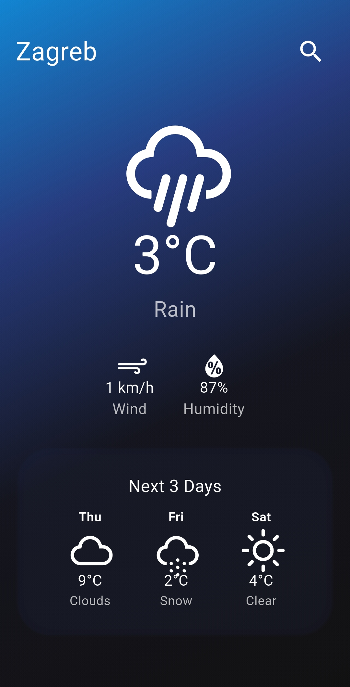

A simple  weather app built with **Flutter** that shows the current weather and a 3-day forecast.  
Supports **searching for cities** and **pull-to-refresh** functionality.  

##  Features
✔️ Show current weather with temperature, condition, and icons  
✔️ Display 3-day weather forecast in a **tablet-friendly layout**  
✔️ **Search for any city** and save last location  
✔️ Beautiful **gradient background**  
✔️ **Pull-to-refresh** support

##  Technologies Used
- **Flutter** (Dart)
- **OpenWeather API** 
- **Shared Preferences** (for saving last searched city)
- **Weather Icons**  

## 📸 Screenshot

